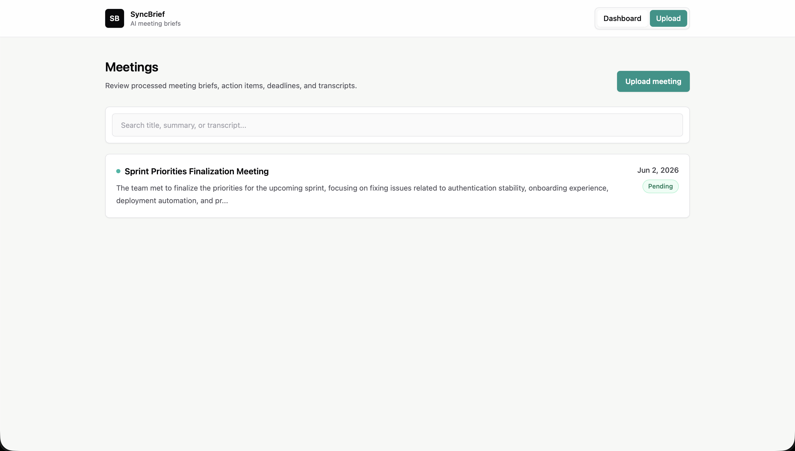
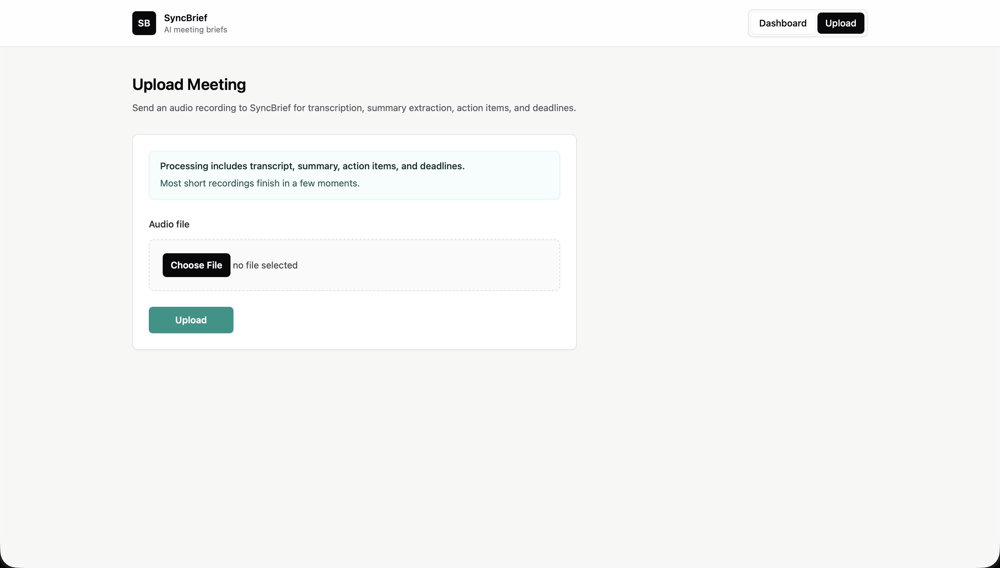
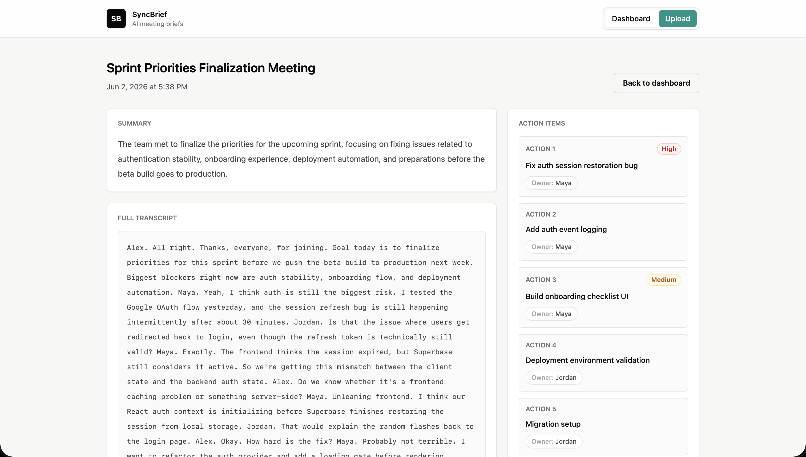

# SyncBrief

SyncBrief is an AI-powered meeting intelligence app that turns audio recordings into structured meeting briefs. Users can upload a meeting recording, generate a transcript with OpenAI, extract a concise summary, identify action items and deadlines, and browse or search saved meetings from a clean SaaS-style dashboard.

The project is built as a full-stack TypeScript monorepo with a React/Vite frontend, an Express API, Supabase Postgres for persistence, and OpenAI for transcription and structured extraction.

## Features

- Upload audio recordings through a simple web interface.
- Transcribe meeting audio with the OpenAI transcription API.
- Generate structured meeting output with an OpenAI chat model:
  - title
  - summary
  - action items
  - deadlines
- Store meeting data in Supabase.
- View all meetings in a dashboard ordered by newest first.
- Open detailed meeting pages with summary, action items, deadlines, and full transcript.
- Search meetings by keyword across title, summary, and transcript.
- Responsive, minimal SaaS-style UI built with Tailwind CSS.

## Tech Stack

- Frontend: React, Vite, TypeScript, Tailwind CSS, React Router
- Backend: Node.js, Express, TypeScript
- Database: Supabase Postgres
- AI: OpenAI API
- File Uploads: Multer
- Package Management: npm workspaces

## Architecture

```txt
syncbrief/
  frontend/              React + Vite client
    src/
      main.tsx           App shell, routes, pages, API calls

  backend/               Express API
    src/
      server.ts          Express app, CORS, route mounting
      routes/
        meetings.ts      Meeting upload, retrieval, and search routes
      lib/
        openai.ts        OpenAI client
        supabase.ts      Supabase service-role client
      config/
        env.ts           Environment variable loading
```

### Request Flow

1. The user uploads an audio file from the frontend.
2. The Express API receives the multipart upload with Multer.
3. The API sends the audio file to OpenAI for transcription.
4. The transcript is sent to an OpenAI chat model for structured JSON extraction.
5. The API saves the meeting record to Supabase.
6. The frontend redirects to the generated meeting detail page.

## Screenshots

### Dashboard


### Upload Meeting


### Meeting Detail


## Local Setup

### Prerequisites

- Node.js 20+
- npm
- Supabase project
- OpenAI API key

### Install Dependencies

From the repo root:

```bash
npm install
```

### Configure Environment Variables

Create environment files for the backend and frontend.

```bash
cp backend/.env.example backend/.env
cp frontend/.env.example frontend/.env
```

If example files are not present, create the files manually using the variables below.

### Run Locally

Start the backend:

```bash
npm run dev:backend
```

Start the frontend:

```bash
npm run dev:frontend
```

Default local URLs:

- Frontend: `http://localhost:5173`
- Backend: `http://localhost:3001`
- Health check: `http://localhost:3001/health`

## Environment Variables

### Backend

Create `backend/.env`:

```env
PORT=3001
FRONTEND_ORIGIN=http://localhost:5173
SUPABASE_URL=https://your-project.supabase.co
SUPABASE_SERVICE_ROLE_KEY=your-service-role-key
OPENAI_API_KEY=your-openai-api-key
```

Notes:

- `SUPABASE_URL` should be the project base URL only. Do not include `/rest/v1`.
- `SUPABASE_SERVICE_ROLE_KEY` should only be used on the backend. Never expose it to the browser.
- Keep `backend/.env` out of version control.

### Frontend

Create `frontend/.env`:

```env
VITE_API_BASE_URL=http://localhost:3001
```

If omitted, the frontend defaults to `http://localhost:3001`.

## API Routes

### Health

```http
GET /health
```

Returns service status.

### List Meetings

```http
GET /api/meetings
```

Returns all meetings ordered by `created_at` descending.

Response includes:

- `id`
- `title`
- `summary`
- `created_at`
- `processing_status`

### Search Meetings

```http
GET /api/meetings/search?q=keyword
```

Performs simple keyword search over:

- `title`
- `summary`
- `transcript`

Uses Supabase `ilike` queries. Semantic search is intentionally not implemented yet.

### Get Meeting Detail

```http
GET /api/meetings/:id
```

Returns the full meeting record, including:

- `title`
- `summary`
- `transcript`
- `action_items`
- `deadlines`
- `audio_filename`
- `created_at`

Returns `404` when the meeting does not exist.

### Upload Meeting Audio

```http
POST /api/meetings/upload
Content-Type: multipart/form-data
```

Accepts one audio file, transcribes it, extracts structured meeting data, saves the meeting to Supabase, and returns the saved meeting.

Example:

```bash
curl -X POST http://localhost:3001/api/meetings/upload \
  -F "file=@meeting-audio.mp3"
```

## Database

SyncBrief expects a Supabase `meetings` table with fields compatible with:

- `id`
- `title`
- `summary`
- `transcript`
- `action_items`
- `deadlines`
- `audio_filename`
- `processing_status`
- `created_at`

`action_items` and `deadlines` are stored as structured JSON data.

## Scripts

From the repo root:

```bash
npm run dev:frontend
npm run dev:backend
npm run build:frontend
npm run build:backend
```

## Future Improvements

- Semantic search with embeddings for meaning-based meeting retrieval.
- Authentication and user-specific meeting workspaces.
- Serverless deployment for the API and frontend.
- Calendar integrations for automatic meeting metadata and event linking.
- Background job processing for longer recordings.
- File storage for uploaded audio assets.

## Status

SyncBrief is an MVP designed to demonstrate a practical AI workflow: audio upload, transcription, structured extraction, persistence, search, and a polished frontend experience.
